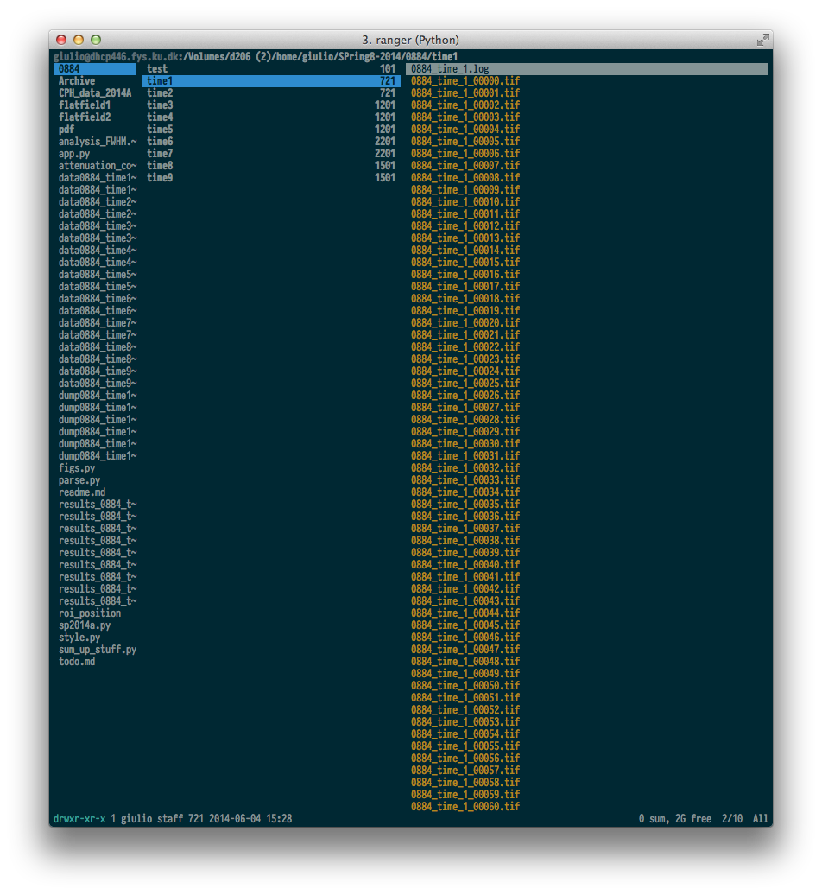
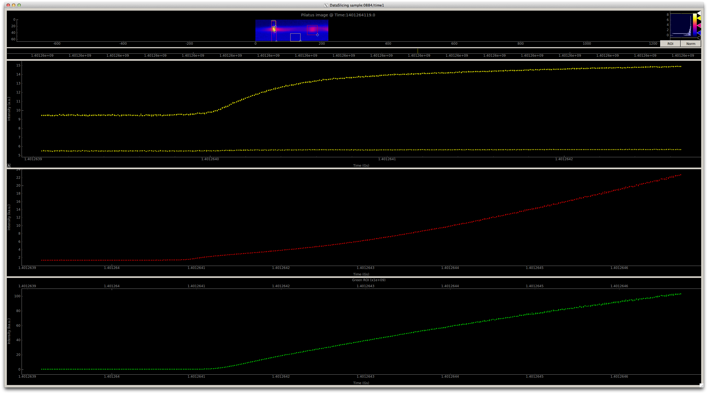

#overview
This code is meant to make analysis of x-ray data from in situ x-ray experiments at the SPring8 bl11xu

## file organization
The idea here is to organize each sample's data in one folder; since we usually take multiple measurements and test measurements on each folder we create an array of subfolders with the same base name as the data they contain.

**a note on performances** *non nix based operating systems may have troubles managing high number of files, so this file organization will also prevent undesired crashes*



# how to use the code
## parse.py
This code is responsible for the actual parsing of the images from the detector.  It's  assumed that they are .tiff files.

All the function and classes used in this scrpit are defined in the sp2014a.py
method (refer to the docstrings for more documentation.)

The script will:

 - load the images
 - perform 3x3 median filter to remove any possible dead pixel
 - load the flatfield images
 - correct for signal background (using empty areas from the detector image)
 - extract the time from the headers and covert to UNIX
EPOCH time
 - dump the times and images to disk with the agile hdf5 file format   

### example
From a terminal that contains the folder named **sample**, with subfolders named  **sample_mesasurement**, and that contains a folder containing the flatfields measurements named **flatfield**

``` bash 
python parse.py sample/sample_mesasurement flatfield
```
The output of the program will tell you what's going on and throw an error if the files exist already.

## app.py
This scripts generate as QT graphical user interface that shows the dector image as a function of time, and offers user movable region of interest (ROI) to visualize the time evolution of the intensity in that region.
The scrpit will also dump a pandas dataframe containing the following informations:

 - center of mass yellow ROI
 - FWHM (hk, and l directions)  orange ROI
 - intensities of red ROI and green ROI
### example

First run app.py inside an ipython shell for every scan recorded.
Adjust the rois and save them to disk (reproducibility, use the funcion dump_roi and load_roi).

``` python 
%run app.py name_of_sample # i.e sample/sample_mesasurement
```

## attenuation correction.py
Lastly we want to stich together all time different measurements for one sample and correct for attenuation changes.
The latter is done manually by selecting the two end points that contain the moment where the attenuation was changed and using their ration to correct the remaining data. This has to be done for every attenuation change.
The resulting corrected data is dumped to disk, and plotted.
For simplicity this program must be run inside the sample folder.
``` bash 
cd ./sample 
python attenuation_correction.py
```

## plot.py

This convenience script will load the dataframe with the data and plot the different data.